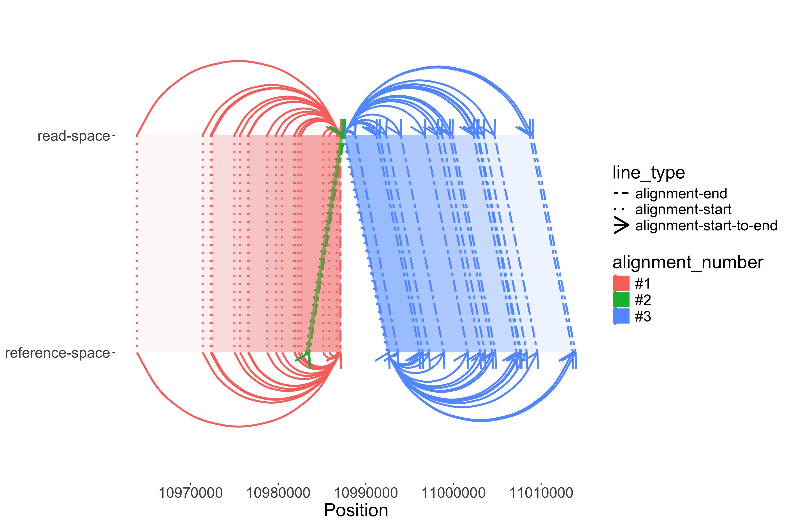

Long read plots
================

## Description

Plot a represenation of long read alignments in a region of interest

<!-- -->

- These plots attempt to visualize a mapping from “read-space” (the
  actual piece of DNA sequenced) to “reference-space” (where the
  portions of the read align to the reference genome).

## Usage:

`Rscript longReadPlot.R --bam $bam --region $region --output $output`

- `--bam` : bam file to plot
- `--region` : region to plot in ucsc format
  e.g. chr17:10958130-11017414
- `--output` : output image file name, the extension determines the
  output format (png, pdf, etc.)
- `--debug` : debug mode, if set to debug mode a tsv file of the
  alignments will be created

## Installation options

1.  Clone the repository and run the longReadPlot.R script directly via
    Rscript
    - Need to have R and the required packages installed
2.  Use the container image to run the script via docker or singularity
    <https://github.com/jlanej/long-read-plot/pkgs/container/long-read-plot>
    - Just need to have docker or singularity installed

## Example usage via singularity

A parameterized example of how to use the plotting script can be found
in the example directory here
<https://github.com/jlanej/long-read-plot/blob/main/examples/example.NA19240.sh>.
This script uses singularity to run the plotting script in a container.

The example image above in this readme can be created by running the
following command:

    #!/bin/bash

    #This example bam is packaged within image, bind the bam's directory for non-packaged bams
    bam=/long-read-plot/examples/NA19240_2020_merged.ccs.hg38.aligned.chr17_10958130_11017414.bam
    region=chr17:10958130-11017414
    outputDir=$HOME/tmp/NA19240_output/
    output=$outputDir/NA19240_2020_merged.ccs.hg38.aligned.chr17_10958130_11017414.png

    singularity run --containall \
    --bind "$outputDir/" \
    "docker://ghcr.io/jlanej/long-read-plot:main" \
    Rscript /long-read-plot/longReadPlot.R --bam $bam --output $output --region $region --debug
